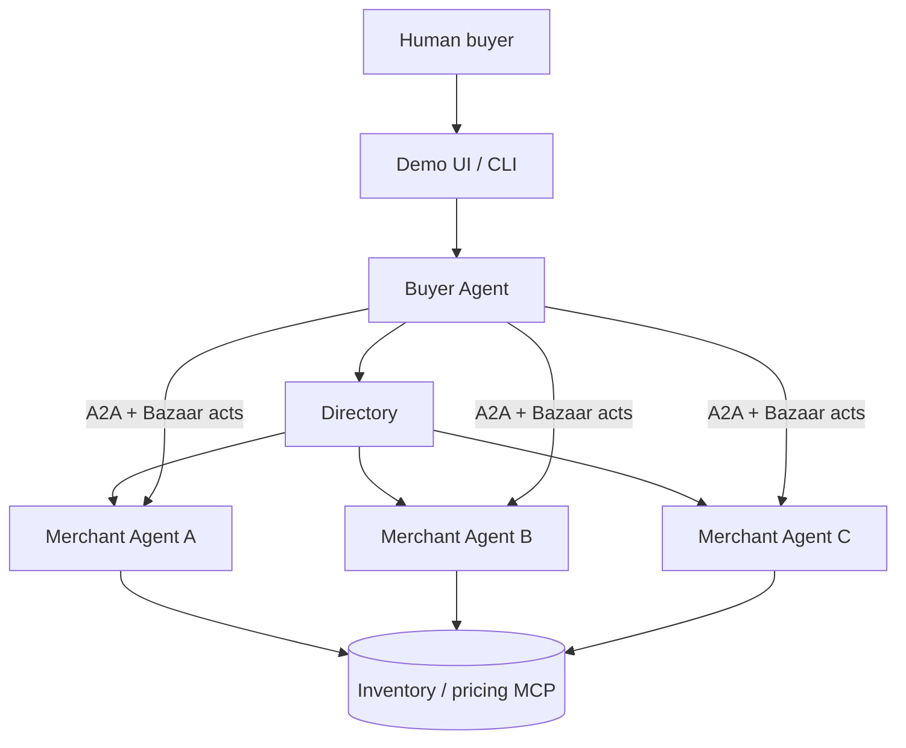

# Architecture

## System context



## Components

### Directory

Lightweight registry, not a blockchain.

- Stores merchant **Agent Cards** (name, endpoint, skills, Bazaar extension params)
- Indexes **catalog entries** (SKU, title, list price, tags)
- Exposes `GET /merchants`, `GET /search?q=headphones`

Merchants self-register in v1 (`POST /merchants`). Auth = API key.

### Buyer agent

**Client** in A2A terms.

1. Parse human mandate → structured `BuyerMandate`
2. Query directory for matching merchants
3. For each merchant: `SendMessage` → open negotiation Task
4. Run strategy loop (LLM suggests counter; protocol validates)
5. Compare final offers; pick best; surface Deal Record

Uses A2A `contextId` to group parallel negotiations for one shopping trip.

### Merchant agent

**Server** in A2A terms.

1. Expose Agent Card with skill `sell-goods` + Bazaar extension
2. On incoming message: parse Bazaar act from `data` part
3. **Policy engine** (pure Python): floor price, max discount, allowed term changes
4. LLM optional: choose *which* lever to move, generate friendly text part
5. Respond with counter / accept / `input-required` (manager approval above threshold)

Internal catalog can be JSON file in v1; MCP later for ERP/inventory.

### Protocol package (`packages/protocol`)

Shared library — no HTTP, no LLM.

- JSON Schema validation for acts and terms
- `NegotiationSession` state machine (turns, rounds, terminal states)
- Deal Record canonicalization + hash
- Errors: `NOT_YOUR_TURN`, `MANDATE_EXCEEDED`, `INVALID_ACT`

Both agents depend on this so they cannot drift.

## A2A mapping

| Bazaar concept | A2A concept |
| --- | --- |
| Negotiation session | `Task` |
| Shopping trip | `contextId` |
| Offer / counter | `Message` with `data` part + optional `text` part |
| Need human approval | `TASK_STATE_INPUT_REQUIRED` |
| Agreed deal | `Task` → `COMPLETED` + `Artifact` (Deal Record) |
| Walk away | `reject` or `withdraw` act → terminal Task |

## Data flow (single counter round)

```
Buyer                          Merchant
  │                               │
  │  SendMessage(offer)           │
  │ ─────────────────────────────►│
  │                               │ validate act, check policy
  │                               │ LLM: strategy
  │  Task(NEGOTIATING)            │
  │ ◄─────────────────────────────│
  │  Message(data: counteroffer)  │
  │                               │
  │  SendMessage(counter)         │
  │ ─────────────────────────────►│
  │                               │
```

## Security (v1 vs later)

| Concern | v1 | Later |
| --- | --- | --- |
| Transport | HTTPS localhost | TLS + mTLS |
| Agent auth | API key in header | OAuth / Agent Card `securitySchemes` |
| Deal integrity | SHA-256 canonical JSON | Ed25519 dual signatures |
| Mandate proof | Self-declared JSON | VC / org attestation |

## Deployment (demo)

All services on localhost:

| Service | Port (planned) |
| --- | --- |
| Directory | 8000 |
| Merchant A | 8001 |
| Merchant B | 8002 |
| Merchant C | 8003 |
| Demo UI | 3000 |

Docker Compose in Phase 2.
