# Architecture

Visual reference for Agent Bazaar. Diagrams use [Mermaid](https://mermaid.js.org/); they render on GitHub and in most Markdown viewers.

**Related:** [Negotiation protocol](./protocol.md) · [Project plan](../PLAN.md)

---

## Table of contents

1. [Protocol stack](#1-protocol-stack)
2. [System context](#2-system-context)
3. [Runtime components](#3-runtime-components)
4. [Package map](#4-package-map)
5. [Discovery and parallel negotiation](#5-discovery-and-parallel-negotiation)
6. [Single negotiation sequence](#6-single-negotiation-sequence)
7. [Message anatomy](#7-message-anatomy)
8. [Merchant agent internals](#8-merchant-agent-internals)
9. [Buyer agent internals](#9-buyer-agent-internals)
10. [Negotiation state machine](#10-negotiation-state-machine)
11. [Human-in-the-loop](#11-human-in-the-loop)
12. [Deal record flow](#12-deal-record-flow)
13. [Deployment (demo)](#13-deployment-demo)
14. [Security phases](#14-security-phases)
15. [A2A concept mapping](#15-a2a-concept-mapping)

---

## 1. Protocol stack

Agent Bazaar does not replace A2A. It adds a **negotiation profile** on top.

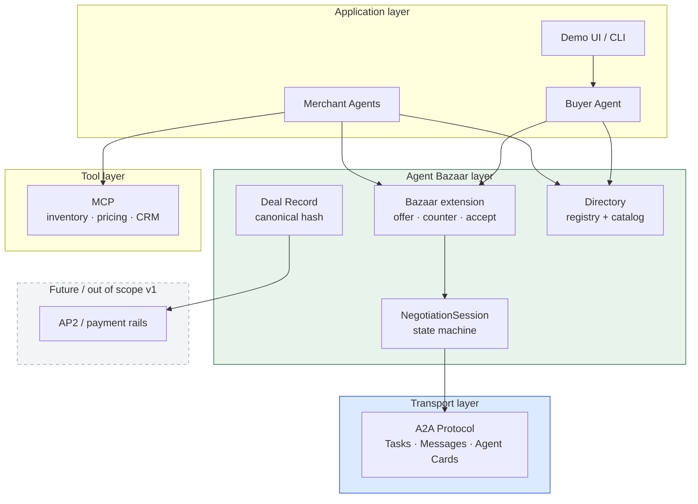

| Layer | Protocol / component | Role |
| --- | --- | --- |
| Tool | MCP | Merchant reads catalog, floor price, stock |
| Transport | A2A | Agent discovery, task lifecycle, streaming |
| Negotiation | Bazaar extension | Typed commercial acts in `data` parts |
| Registry | Directory | Who sells what; not on the wire during haggle |
| Settlement | AP2 (later) | Pay after `accept` |

---

## 2. System context

One human shopping trip, multiple merchant agents competing.

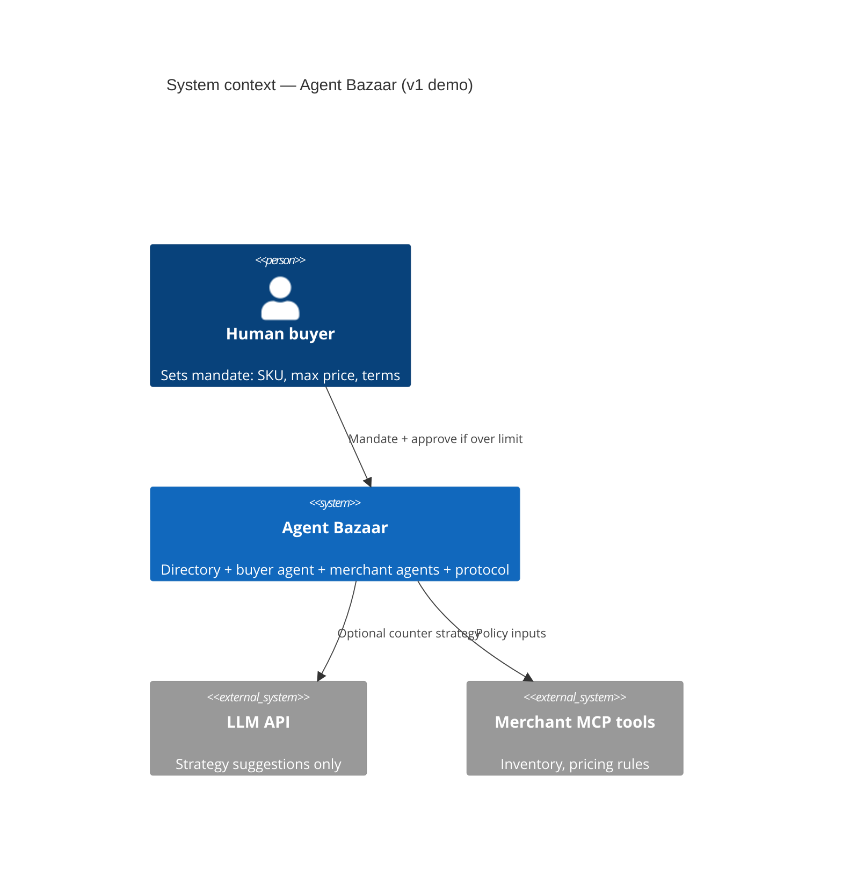

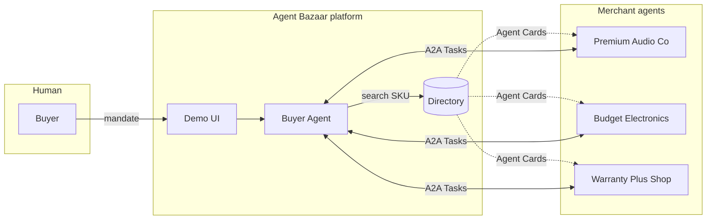

---

## 3. Runtime components

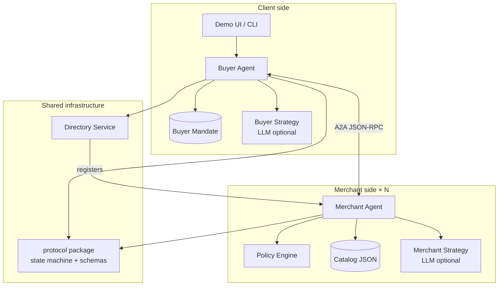

**Separation of concerns:** the LLM never advances session state. Only `packages/protocol` mutates turns, sequences, and terminal states.

---

## 4. Package map

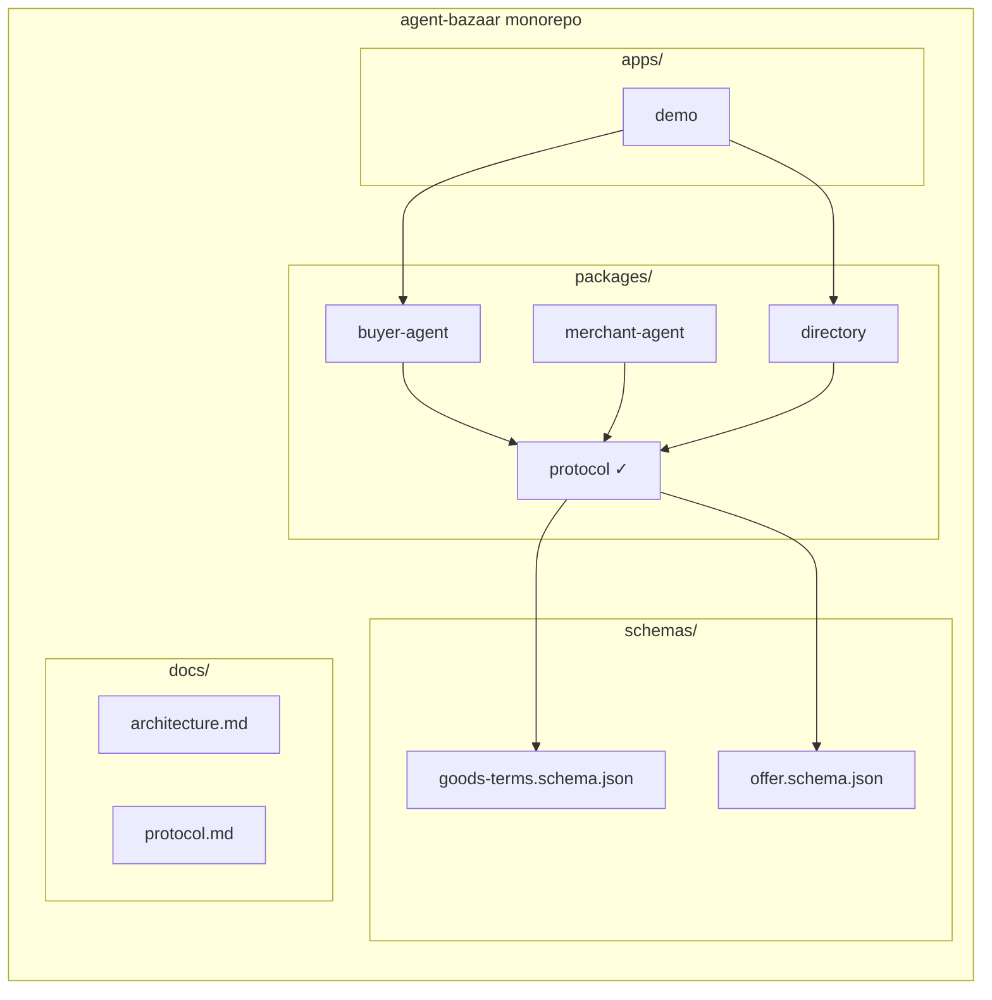

---

## 5. Discovery and parallel negotiation

One `contextId` groups every Task opened for the same shopping trip.

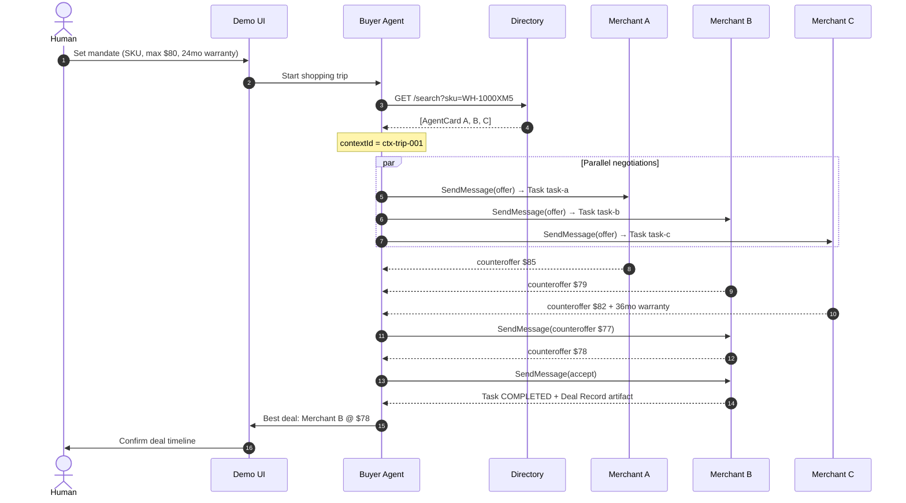

---

## 6. Single negotiation sequence

Detail for **one** buyer ↔ merchant pair (one A2A Task).

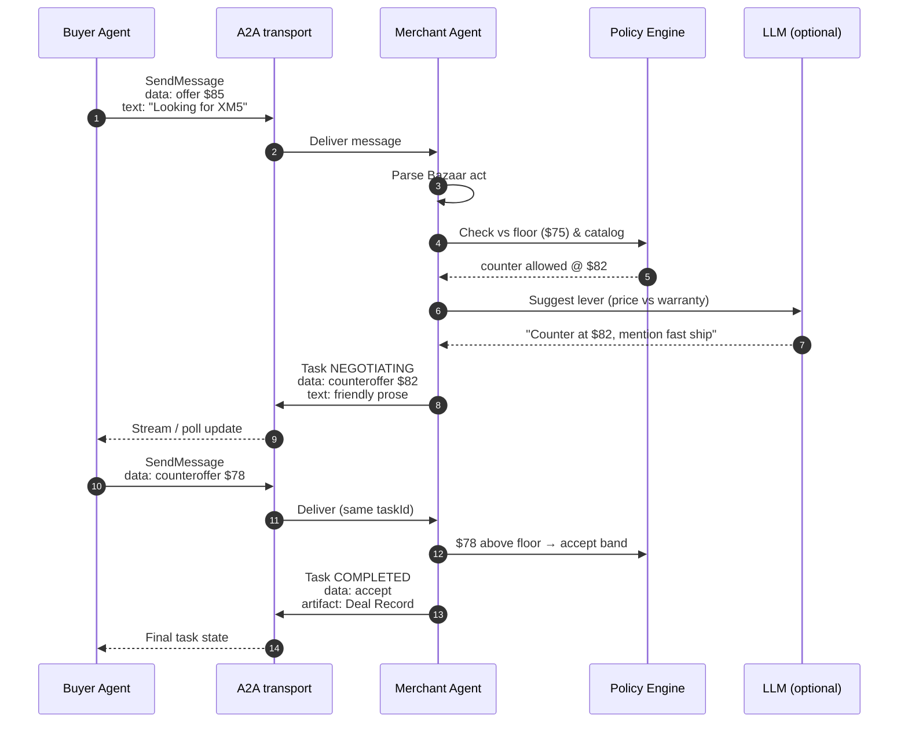

---

## 7. Message anatomy

Every commercial turn is an A2A **Message** with two layers.

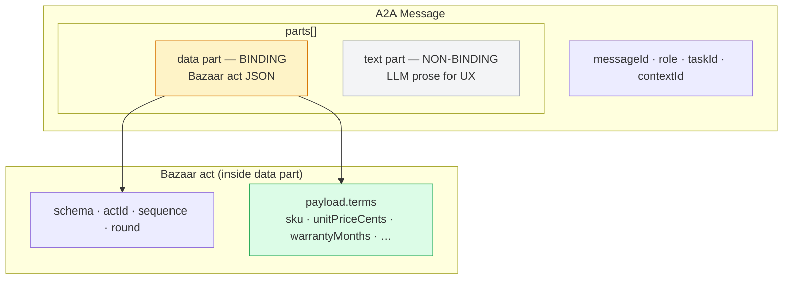

---

## 8. Merchant agent internals

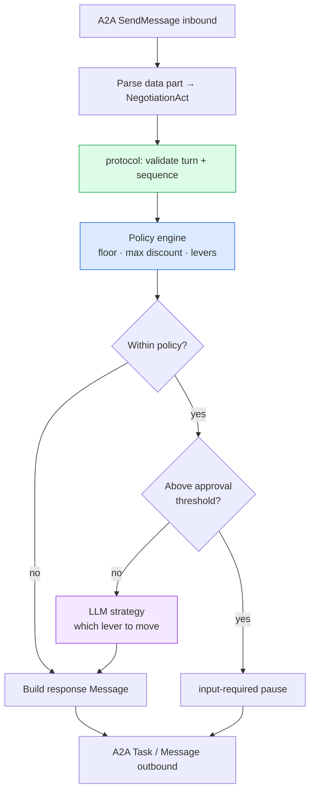

---

## 9. Buyer agent internals

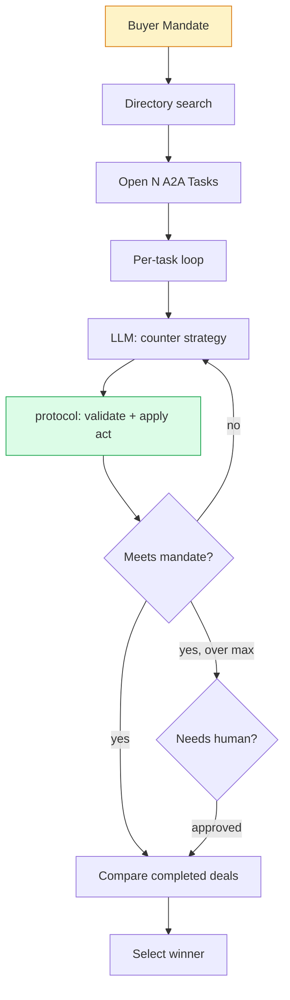

---

## 10. Negotiation state machine

Implemented in `packages/protocol`. One instance per A2A Task.

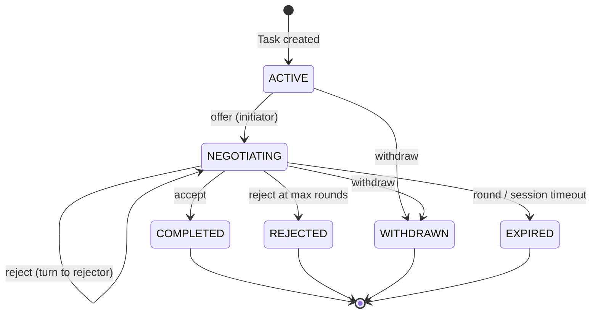

**Turn rule:** after an offer or counteroffer, only the **receiver** may send the next commercial act.

---

## 11. Human-in-the-loop

When a deal exceeds the buyer mandate or merchant approval threshold.

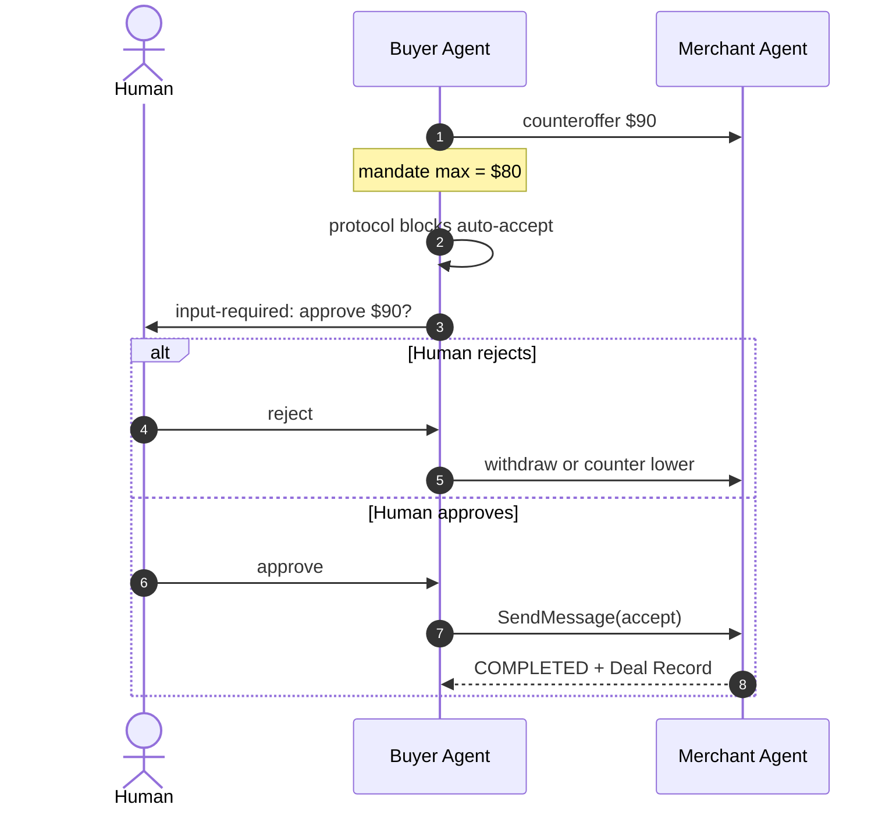

A2A mapping: `TASK_STATE_INPUT_REQUIRED` on the buyer's upstream Task (or merchant-side for manager approval).

---

## 12. Deal record flow

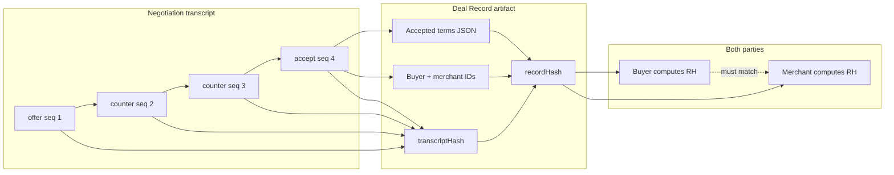

v1: SHA-256 over canonical JSON. Later: Ed25519 dual signatures.

---

## 13. Deployment (demo)

Phase 1–2 local layout.

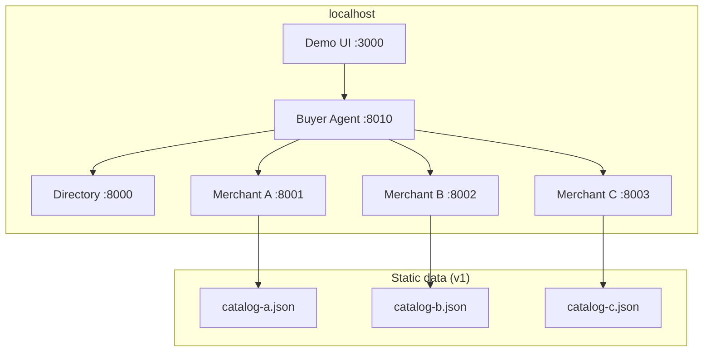

Phase 2 adds Docker Compose to run this stack with one command.

---

## 14. Security phases

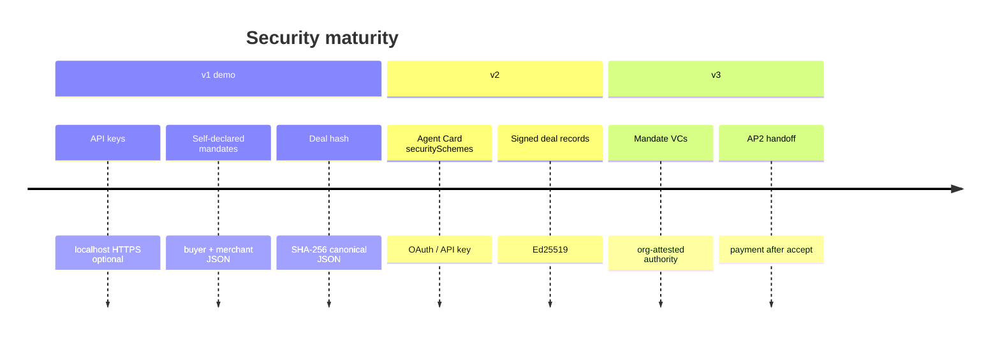

---

## 15. A2A concept mapping

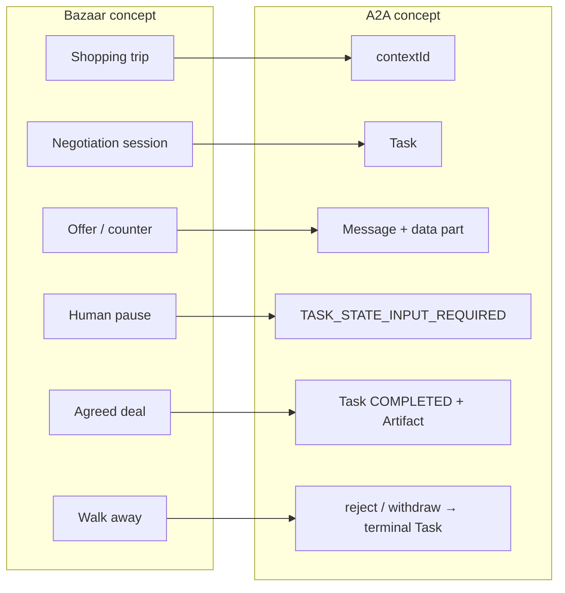

| Bazaar | A2A |
| --- | --- |
| Shopping trip | `contextId` |
| Negotiation session | `Task` |
| Offer / counter | `Message` with `data` part (+ optional `text`) |
| Human pause | `TASK_STATE_INPUT_REQUIRED` |
| Agreed deal | `Task` → `COMPLETED` + `Artifact` |
| Walk away | `reject` / `withdraw` → terminal Task |

---

## Component summaries

### Directory

- Stores merchant **Agent Cards** and catalog index
- `GET /merchants`, `GET /search?q=…`
- Self-register in v1 (`POST /merchants`, API key)

### Buyer agent

A2A **client**: mandate → directory search → parallel Tasks → pick best Deal Record.

### Merchant agent

A2A **server**: Agent Card + policy engine + optional LLM → counters within floor/ceiling.

### Protocol package

Shared state machine, schema validation, deal hashing. No HTTP, no LLM.
